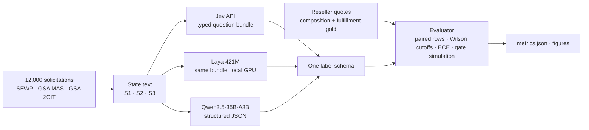

# jev-laya-classification-bench

**Typed-decision models versus a 35B LLM on a real classification job: 12,000 U.S. federal IT solicitations, graded against what a reseller actually quoted.**

[](https://github.com/bhushankinge/jev-laya-classification-bench/actions/workflows/tests.yml)
[](LICENSE)
[](requirements.txt)
[](CITATION.cff)

<picture>
  <source media="(prefers-color-scheme: dark)" srcset="docs/figures/hero-dark.png">
  
</picture>

## The question

A federal IT reseller has to route every incoming solicitation (RFQ). Hardware goes to distributor price lookups, configured builds to an engineer and an OEM portal, software to a publisher-authorization check, services to a statement-of-work workflow. **Can a typed-decision model, which answers a fixed bundle of questions with a calibrated probability per answer, do this as accurately as an LLM? And is its confidence trustworthy enough to auto-accept answers without a human?**

Three model paths labeled the same 12,000 solicitations with the same question schema:

| | What it is | Where it ran |
|---|---|---|
| **Jev** | TypeSafe System One API, model `jev-1.13.0`. Typed questions (choice / score / noul) with calibrated probabilities | TypeSafe cloud, 10 requests/s cap |
| **Laya** | [`convaiinnovations/laya`](https://huggingface.co/convaiinnovations/laya), the 421M-parameter open-weights sibling of Jev (ModernBERT-large, 512-token window), shipped defaults | laptop RTX 2000 Ada 8 GB, eager FP16 |
| **Qwen3.5-35B-A3B** | FP8 on vLLM behind a structured-JSON schema, the LLM already in production for this job | on-prem GPU cluster |

Ground truth is behavioral, not annotated: when a sales rep quoted an opportunity, the product types on the quote lines say what it really was ([how the gold was built](#method)).

## Results

741 opportunities with unambiguous quote gold. Every source is scored on the same rows.

| Source | Primary-class accuracy | Calibration error (ECE) | Cutoff for 95% precision (Wilson lower bound) | Auto-accepted at that cutoff | Fulfillment-mode accuracy (n=634) |
|---|---|---|---|---|---|
| Jev, variant A-S2 | **91.9%** | 0.049 | 0.94 | **86.5%** | 65.0% |
| Qwen3.5-35B-A3B | 89.6% | n/a (3 confidence levels) | not reachable | none | **71.0%** |
| Laya 421M, variant A-S2 | 78.0% | 0.322 | not reachable | none | 45.7% |

Every number: [`results/e2-full/metrics.json`](results/e2-full/metrics.json), key `by_source.<source>.paired`. Full write-up: [the experiment report](docs/reports/2026-09-24-classification-experiments-report.md).

### 1. One source's confidence supports an auto-accept gate

<picture>
  <source media="(prefers-color-scheme: dark)" srcset="docs/figures/precision_coverage-dark.png">
  
</picture>

Jev's confidence is calibrated (ECE 0.049). At a cutoff of 0.94 it accepts 86.5% of rows with observed precision 96.7%, and the Wilson 95% lower bound stays at or above 95% at every cutoff from 1.0 down to 0.94. Qwen reports three confidence levels by prompt design; its "high" bucket covers 97.8% of rows at 90.1% precision, so no bucket reaches 95%. Laya's precision never clears the bound at any depth.

### 2. Prompt variants did not move accuracy

<picture>
  <source media="(prefers-color-scheme: dark)" srcset="docs/figures/e1_variants-dark.png">
  
</picture>

Nine Jev variants cross three question structures (twelve presence questions, one 12-way choice, hierarchical choices) with three input sizes (title and description, plus line items, plus a 1,500-character attachment excerpt). All nine land between 91.2% and 91.9% on the same 741 rows, inside each other's 95% intervals. The rule written in [`pipeline/RUN.md`](pipeline/RUN.md) before the runs picked the cheapest adequate variant, A-S2. Caveat: the tested excerpt was short and present on 5.6% of rows; a much larger or better-targeted one is untested.

### 3. Fulfillment mode is hard for every model

<picture>
  <source media="(prefers-color-scheme: dark)" srcset="docs/figures/per_class_f1-dark.png">
  
</picture>

Telling distributor catalog SKUs ("à la carte") from OEM-configured builds tops out at 71.0% accuracy, with configured-build precision between 19% and 36%. The answer usually lives in a bill of materials or configurator quote inside an attachment, not in the notice text. The fulfillment gold is a heuristic until human validation (E4). Maintenance & Support (n=32) and Services (n=6) are indicative only.

### 4. Jev and Qwen agree on 91.0% of 11,931 rows

<picture>
  <source media="(prefers-color-scheme: dark)" srcset="docs/figures/agreement-dark.png">
  
</picture>

The disagreements cluster in four places: Hardware vs Other (Qwen calls "IT equipment per attached BOM" Other), Hardware vs Software, Software vs Maintenance & Support in both directions, and Services vs Software or Other. Those 1,068 rows are the pool for blind human adjudication.

### 5. One queueing rule decides how much gets automated

<picture>
  <source media="(prefers-color-scheme: dark)" srcset="docs/figures/gate-dark.png">
  
</picture>

The design spec sent any row with a raised flag to human review. The `brand_name_only` flag fires on 54% of rows (Jev), so that rule automates 26.6% of volume. Recording flags as attributes instead automates 91.9% at the same primary precision (93.8%, n=721, vs 93.5%, n=214 scored rows), and the review queue fills with genuine model disagreements instead.

## Cost and latency

| Source | Cost for 12,000 rows | Latency / throughput | Errors |
|---|---|---|---|
| Jev | $0.78 at list price (1,555 input tokens per opportunity) | p50 185 ms, p95 273 ms, 8 concurrent | 0 |
| Qwen3.5-35B-A3B | about 80 GPU-minutes on a shared cluster | 2.7 opportunities/s at 16 concurrent | 69 malformed JSON (0.6%) |
| Laya 421M | local laptop GPU | p50 299 ms, p95 576 ms, 2.9 rows/s, single row | 0 |

Details: [`results/e5-cost.md`](results/e5-cost.md).

## Laya: reproducible issues and hypotheses

Laya ran with shipped defaults: single row, default config, no threshold tuning, no alternative checkpoint. These numbers describe the defaults on this task, not a ceiling. What worked: zero crashes over 12,927 rows, deterministic output, stable latency around 300 ms, the same request schema as Jev so the question bundle ran unchanged, and 93% Hardware precision.

Observed, with evidence in [report section 9.4](docs/reports/2026-09-24-classification-experiments-report.md#94-laya-in-depth):

- **Presence questions over-fire.** Laya emits 4.05 components per row against 1.95 for Jev; its `rfi_market_research` and `text_insufficient` flags fire on 63% and 71% of rows (Jev 13% and 15%), where the discovery run found true RFI rates of 2% to 3%. Its `brand_name_only` rate (49%) is in line with the discovery run.
- **Accuracy drops before the window fills.** 81.5% on states under 600 characters (n=519), 65.8% at 600 to 1,200 characters (n=117, roughly 150 to 300 tokens), inside the 512-token window. Longer states recover partly (72.9%, n=59; 74.0%, n=50); Jev and Qwen show no comparable drop.
- **Class definitions are silently truncated.** The sequence packer caps the question head at 192 tokens. With seven options, each class definition is cut to 25 tokens, which drops the text that separates hardware from software.

Hypotheses, none tested yet:

1. Raise `head_max_len` or shorten criteria so definitions survive; measure on the same 741 rows.
2. Warn when `build_sequence` truncates options or instructions.
3. Run the `laya-typed-decisions` and `laya-multilingual` checkpoints on the same bundle.
4. Fit per-question noul thresholds or a temperature on a held-out slice instead of 0.5.
5. Ask `primary_class` alone with full definitions, then the rest.
6. Record `n_tokens` per row and re-bucket accuracy by tokens actually kept.

Replications and pull requests are welcome; please open an issue first.

## Method



- **Sample.** 12,000 solicitations (SEWP 6,000, GSA MAS 3,000, GSA 2GIT 3,000) created between 2024-11-08 and 2026-09-22, drawn in deterministic `md5(id)` order.
- **Composition gold.** For every quoted opportunity, the product types on the latest quote's lines give the true class set. 927 sampled rows have a quote; 741 of them have a single unambiguous primary class and were labeled by all three sources.
- **Fulfillment gold.** Configurator fingerprints on quote lines (for example Cisco CCW line numbers and deal ids) mark configured builds; distributor-only lines mark à la carte. This rule is a heuristic until human validation.
- **One schema.** Jev and Laya receive byte-identical question bundles. Qwen's JSON is mapped onto the same label schema ([`pipeline/schema.py`](pipeline/schema.py)).
- **Evaluator.** Paired scoring on rows every source labeled, per-class precision, recall and F1, 10-bin ECE, precision-coverage curves, and cutoffs set at the deepest confidence whose Wilson 95% lower bound stays above target along the monotone envelope ([`pipeline/evaluate.py`](pipeline/evaluate.py)).
- **Pre-registered selection.** The E1 winner rule (accuracy, then coverage at the cutoff, then the cheaper input) was written in [`pipeline/RUN.md`](pipeline/RUN.md) before the runs.

| Experiment | Status |
|---|---|
| E0 sample, discovery labeling, gold | done |
| E1 nine Jev variants plus Laya | done |
| E2 full three-source comparison, cutoffs, gate simulation | done |
| E3 blind human adjudication of disagreements | pending: review UI built, not hosted |
| E4 fulfillment gold validation | pending |
| E5 cost and latency | done |
| E6 drift regression | procedure written |

## Limitations

- Quote gold measures agreement with what reps quoted. It skews to pursued opportunities and to Hardware (77% of single-class rows).
- 741 gold rows; small classes (Services n=6, Maintenance & Support n=32) are indicative only.
- Subclass, lifecycle and domain answers have no gold yet.
- One organization, one domain, one Jev version (`jev-1.13.0`), one day of runs.
- 69 Qwen rows (0.6%) never parsed and are excluded from paired metrics; they are not random.

Full list: [report section 15](docs/reports/2026-09-24-classification-experiments-report.md#15-limitations-and-threats-to-validity).

## Repository

| Path | Contents |
|---|---|
| `pipeline/` | schema, question bundles and state builders, Jev / Laya / Qwen labelers (resumable JSONL), mapping onto one label schema, evaluator, review-queue client, HTML report |
| `figures/make_figures.py` | every figure in this README, rendered from committed metrics |
| `results/e1-*/`, `results/e2-full/` | every metric in the study as `metrics.json` plus `env.json` |
| `results/e5-cost.md` | cost and latency per source |
| `qwen_discovery/` | the discovery labeler and the aggregate findings that fixed the taxonomy |
| `docs/reports/` | the full experiment report |
| `docs/specs/` | the approved research design |
| `tests/` | the test suite, run in CI |

Not published: the solicitation sample, the gold files and the label files. They carry the reseller's opportunity and quote ids. The evaluator ran on them locally; the aggregate results are committed.

## Reproduce

Regenerate every figure from the committed metrics, and run the tests:

```bash
pip install -r requirements.txt
python3 -m figures.make_figures
python3 -m pytest -q
```

Run the pipeline on your own data. It expects a JSONL sample with `id, vehicle, title, description, rfq_type, lines, attachment_text` per row, a composition gold file `{id, vehicle, classes}` and a fulfillment gold file `{id, vehicle, fulfillment_mode}`. Secrets and endpoints come from environment variables; copy `.env.example` to `~/.config/laya-jev-bench.env`.

```bash
python3 -m pipeline.label_jev --variant A --state S2 --verify          # 3 rows, prints raw Jev answers
python3 -m pipeline.label_jev --variant A --state S2 --ids-from gold/composition-<date>.jsonl --vehicle-balanced
$LAYA_PYTHON -m pipeline.label_laya --variant A --state S2 --ids-from gold/composition-<date>.jsonl --vehicle-balanced
python3 -m pipeline.label_qwen
python3 -m pipeline.evaluate --run e2 --jev A-S2 --laya A-S2 --qwen v2 \
  --composition gold/composition-<date>.jsonl --fulfillment gold/fulfillment-<date>.jsonl
python3 -m pipeline.report --run e2
```

[`pipeline/RUN.md`](pipeline/RUN.md) has the full E0 to E7 sequence.

## Citation

```bibtex
@software{kinge2026jevlaya,
  author  = {Kinge, Bhushan},
  title   = {jev-laya-classification-bench: Typed-decision models versus an LLM on 12,000 federal IT solicitations},
  year    = {2026},
  version = {1.0.0},
  url     = {https://github.com/bhushankinge/jev-laya-classification-bench},
  license = {Apache-2.0}
}
```

GitHub's "Cite this repository" button reads [`CITATION.cff`](CITATION.cff).

## Related

- [laya-cuda-bench](https://github.com/bhushankinge/laya-cuda-bench): the companion study. How many Laya decisions per second one NVIDIA GPU serves under a p99 latency target, on four GPUs, with Jev and Qwen baselines in the same units.
- [Laya on Hugging Face](https://huggingface.co/convaiinnovations/laya).

## License

Apache-2.0. Copyright 2026 Bhushan Kinge.
