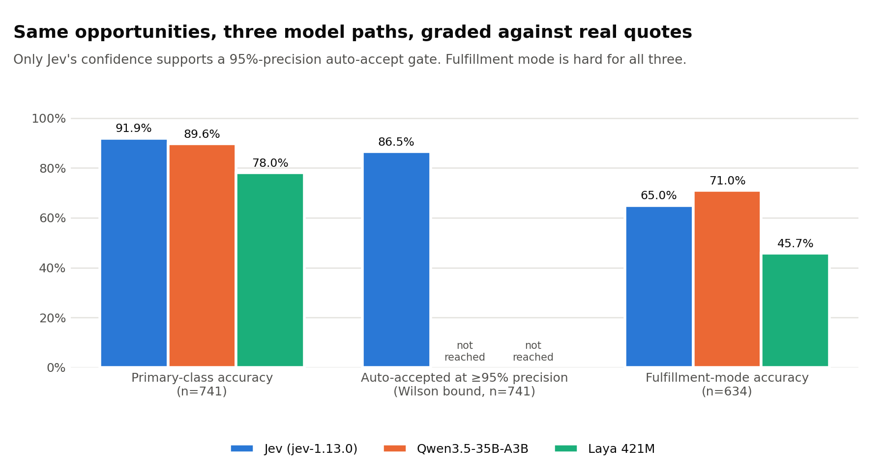
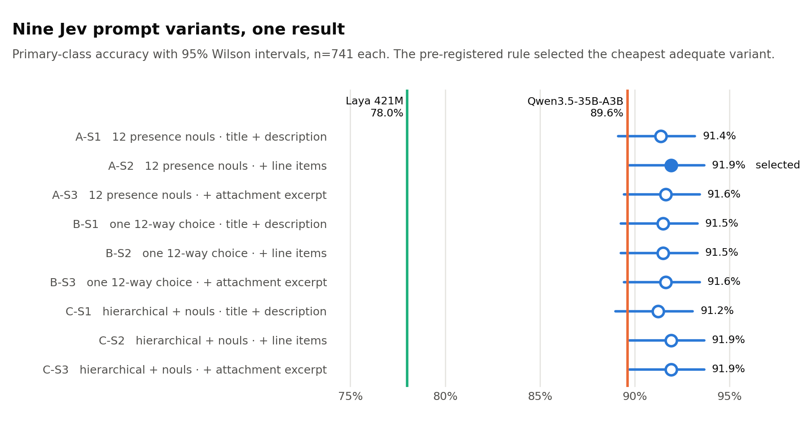
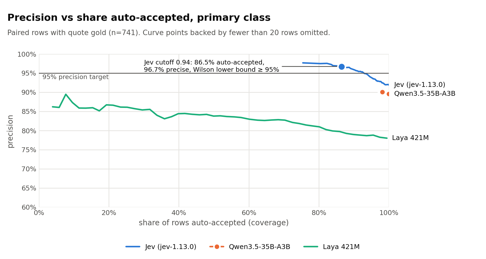
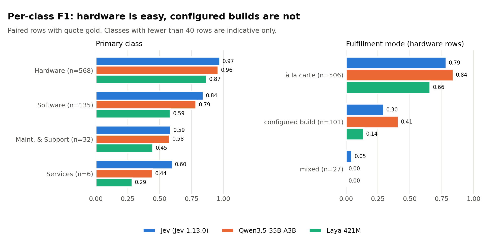
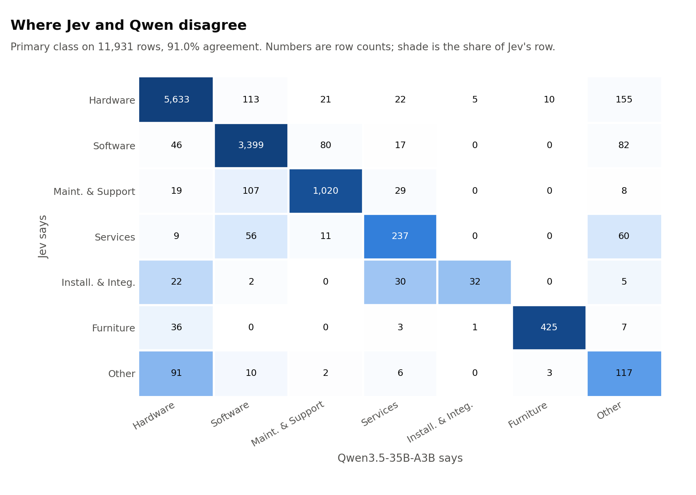
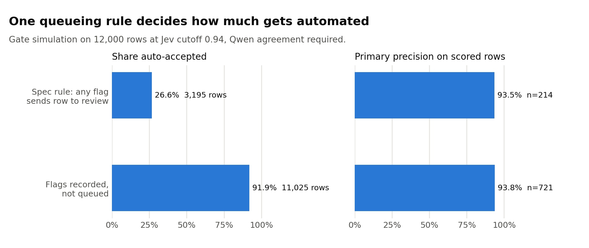

# Opportunity classification with typed-decision models: Jev, Laya and Qwen on 12,000 federal RFQs

Full experiment record, 2026-09-22 to 2026-09-24, written as the source for community posts and pull requests on the Laya repositories. Everything below is drawn from files in this repository (results, spec, runbook, and the gold and label files that stay private) and the companion Laya CUDA bench repository. Nothing is quoted from memory.

This is the public version: company identifiers, record ids and internal hosts have been removed (Section 17.2 lists what). The study was run by a federal IT reseller on its own opportunity and quote data; it is called "the reseller" below.

---

## 1. Executive summary

The reseller receives federal IT solicitations (RFQs) from SEWP, GSA MAS and GSA 2GIT and needs each one classified automatically: what is being bought (hardware, software, support, services...), which subclasses are present, whether it is a renewal, which solution domain it belongs to, and, for hardware, whether a reseller can source it from a distributor catalog ("à la carte") or must configure it in an OEM portal such as Cisco CCW ("configured build"). The classification feeds routing and automation triggers in the CRM.

Three model paths were compared on the same 12,000 opportunities using the same typed-question schema:

| Path | What it is | Where it ran |
|---|---|---|
| **Jev** | TypeSafe System One API, model `jev-1.13.0`, typed decisions (choice / score / noul) with calibrated probabilities | TypeSafe cloud, 10 requests per second cap |
| **Laya** | `convaiinnovations/laya` 421M English checkpoint (ModernBERT-large backbone, 512-token window), `laya` package 0.3.3, the open-weights sibling of Jev with the identical request schema | local NVIDIA RTX 2000 Ada laptop GPU, 8 GB, eager FP16 |
| **Qwen** | Qwen3.5-35B-A3B-FP8 served by vLLM behind a structured-JSON schema, the LLM already in production for this job | on-prem HPE Private Cloud AI cluster |

Ground truth for the top-level class came from the reseller's own quotes: when a rep quoted an opportunity, the product types on the quote lines say what it really was. Ground truth for fulfillment mode came from configurator fingerprints on quote lines.

**Headline results (741 opportunities with unambiguous quote gold, all three sources scored on the same rows):**

| Source | Primary-class accuracy | Expected calibration error | Confidence cutoff reaching 95% precision (Wilson lower bound) | Share auto-accepted at that cutoff | Fulfillment-mode accuracy |
|---|---|---|---|---|---|
| Jev A-S2 | **0.919** | 0.049 | 0.94 | **86.5%** | 0.650 |
| Qwen v2 | 0.896 | n/a (3 confidence buckets) | not reachable | none | **0.710** |
| Laya A-S2 | 0.780 | 0.322 | not reachable | none | 0.457 |

<picture>
  <source media="(prefers-color-scheme: dark)" srcset="../figures/hero-dark.png">
  
</picture>

Findings that matter:

1. **Jev beats the 35B LLM by 2.3 points on the top-level class and is the only source whose confidence supports an auto-accept gate.** At a 0.94 cutoff it accepts 86.5 percent of rows at a Wilson-bounded 95 percent precision (observed 96.7 percent).
2. **All nine Jev question and state-text variants land within five rows of each other (0.912 to 0.919 on 741).** Adding line items, adding a 1,500-character attachment excerpt, hierarchical questions, or a 12-way subclass choice changed nothing measurable. The cheapest adequate variant (A-S2) won on the pre-registered tie-break.
3. **Fulfillment mode is the weak spot for every model:** 0.65 (Jev), 0.71 (Qwen), 0.46 (Laya) against quote gold, with configured-build precision 0.25 to 0.36. The 90 percent target is far away. This is the question whose answer usually lives inside a BOM or configurator quote in an attachment, not in the notice text.
4. **Laya, as shipped, is not competitive on this task at 0.78,** and its calibration is poor (ECE 0.32, median primary confidence 0.41). Section 9 analyzes why: over-firing presence questions (4.05 components per row vs 1.95 for Jev), flags firing on 63 to 71 percent of rows, length sensitivity that begins well before the 512-token window is full, and state truncation for the longest rows (the class definitions themselves fit the head budget; an earlier draft of this report said otherwise). These are the concrete, reproducible items for a community contribution.
5. **The `brand_name_only` flag fires on 54 percent of rows (Jev) and 39 percent (Qwen).** The spec's "always queue when any flag is true" rule would cut auto-accept coverage from 92 percent to 27 percent for no precision gain. That flag should become an attribute, not a queue trigger.
6. **Cost:** Jev labeled all 12,000 opportunities for $0.78 at list price ($0.042 per million input tokens), median latency 185 ms from Arizona. Laya ran at 2.9 rows per second single-row on a laptop GPU. Qwen took about 80 minutes of a shared GPU cluster at 16 concurrent requests.

Experiments E0, E1, E2 and E5 are complete. E3 and E4 (human adjudication, fulfillment validation) wait on hosting the Classification Review page, which is built and tested but not deployed. E6 is the regression procedure. E7's report exists for the final run.

---

## 2. Background and motivation

### 2.1 The business problem

Solicitations arrive daily from SEWP and GSA (ITES-4H was excluded from these experiments by decision). Each needs a class so that the CRM can route it: hardware to distributor price lookups, configured builds to a configuration engineer and an OEM portal task, renewals to an incumbent lookup, software to a publisher-authorization check, services to a SOW workflow, RFIs to the capture queue. The legacy classifier (a hosted model, since retired) produced coarse tags whose precision had never been measured.

### 2.2 Why typed-decision models

An LLM answers "what is this RFQ about" with free text or constrained JSON at roughly one second per call. A typed-decision model (Jev, Laya) answers a fixed bundle of questions in one forward pass, in about 200 ms, returning a probability per option and a calibrated confidence per question. If the confidence is trustworthy, it can gate what gets auto-accepted. The experiments test both the accuracy and the trustworthiness of that confidence against real quote outcomes.

### 2.3 Prior work in this project

- **Text-grounded discovery (2026-09-22, `qwen_discovery/QWEN_FINDINGS.md`).** 12,000 opportunities labeled by Qwen with a free-text escape hatch to see what classes the text actually supports. This produced the target taxonomy (Section 4) and two findings that shaped the design: the legacy `software/renewal` tag was only 69 percent precise (it meant "recurring-shaped thing", not "renewing an existing entitlement"), so lifecycle became a component attribute; and `brand_name_only` restrictions appear on 49 to 66 percent of notices depending on vehicle.
- **Laya CUDA capacity bench (companion repository, 2026-09-22 to 09-23).** A separate project measuring decisions per second under p99 latency SLOs on four NVIDIA GPUs, with Jev and Qwen baselines in the same units. Its public-safe headline numbers are in Section 13 because they complete the self-host cost picture.

---

## 3. Timeline

| Date (Phoenix) | Event |
|---|---|
| 2026-09-22 | Discovery run: 12,000-row sample built, labeled by Qwen (v1 schema), taxonomy findings written. Design spec approved. Two implementation plans written and executed: the research pipeline (25 commits, 49 tests) and the CRM Classification Review page (11 commits on branch `feature/classification-review`). Composition and fulfillment gold built from quotes; fulfillment rule amended once after the first build. Smoke run: 500 rows through Jev A-S2 and Qwen v2. |
| 2026-09-23 08:26 | E1 launched: nine Jev variant runs on the 927 gold-overlapping rows, Laya A-S2 on the same rows, full Qwen v2 pass on 12,000 rows at 16 concurrent. |
| 2026-09-23 08:41 | Nine Jev runs done (about 93 s each, zero errors). Laya E1 done (zero errors). |
| 2026-09-23 09:46 | Qwen pass done plus one retry pass; 69 rows remain permanently unparseable. Nine E1 evaluations run. Winner A-S2. |
| 2026-09-23 09:50 to 10:52 | Jev A-S2 and Laya A-S2 over all 12,000 rows (zero errors each). Final E2 evaluation over all three sources. E7 report built. E5 cost note written. |
| 2026-09-23 | User supplied Jev's documented input limits (64k tokens per request, 32k for state plus longest question); spec risk line updated. |
| 2026-09-24 | This report. |

---

## 4. Label schema

Every labeler, and later every human, emits this per opportunity (spec Section 2, `pipeline/schema.py`):

| Field | Values |
|---|---|
| `primary_class` | Hardware · Software · Maintenance & Support · Services · Installation & Integration · Furniture / Facilities · Other |
| `components` | one or more of 12 subclasses: General hardware · Consumables/Supplies · Perpetual license · Subscription/SaaS · Cloud/Hosting · Support/Maintenance contract · Warranty · Professional/Consulting · Training · Installation/Integration · Furniture/Facilities · Other |
| `lifecycle` | new · renewal · upgrade/expansion · replacement/refresh · unknown (of the primary component) |
| `domain` | 15 values: networking, compute/servers, end-user devices, storage/backup, printing/imaging, audio-visual, cybersecurity, business/productivity software, infrastructure/platform software, data center/power/cooling, telecom/mobility, furniture/facilities, lab/scientific/medical, cables/accessories/peripherals, other |
| `fulfillment_mode` | à la carte · configured build · mixed · not applicable (forced to "not applicable" when no hardware subclass is present) |
| `flags` | `rfi_market_research`, `text_insufficient`, `brand_name_only` (booleans) |
| `confidence` | per field, 0 to 1 |
| `source` | jev · laya · qwen · human · quote |

Subclass to class mapping: General hardware and Consumables/Supplies → Hardware; Perpetual license, Subscription/SaaS, Cloud/Hosting → Software; Support/Maintenance contract, Warranty → Maintenance & Support; Professional/Consulting, Training → Services; Installation/Integration → Installation & Integration; Furniture/Facilities → Furniture / Facilities; Other → Other.

Fulfillment definitions given to every model: **à la carte** = every hardware item is an orderable SKU with a list or contract price a rep can add from a distributor or catalog, no OEM configurator step. **Configured build** = at least one item must be configured in an OEM portal (Cisco CCW, HPE OCA or iQuote, Dell Premier, NetApp, Pure) where price depends on configuration, deal registration and human input. **Mixed** = a configured core plus à la carte add-ons.

---

## 5. Data

### 5.1 The 12,000-row sample

Drawn read-only from the reseller's CRM database on 2026-09-22 in deterministic `md5(id)` order, so it is reproducible.

| Property | Value |
|---|---|
| Rows | 12,000: SEWP 6,000 · GSA MAS 3,000 · GSA 2GIT 3,000 |
| Created dates | 2024-11-08 to 2026-09-22 |
| Solicitation type | RFQ 10,276 · MRR (market research) 876 · RFI 818 · RFP 30 |
| Rows with structured line items | 1,209 (GSA vehicles mostly) |
| Rows with any attachment text | 668 (5.6%): SEWP 427 · MAS 141 · 2GIT 100 |
| Rows with legacy classification tags | 3,584 |
| Rows with at least one quote of any type | 973 |
| Empty descriptions | 5 |

Fields per row: id, client RFx number, title, legacy tags, created timestamp, description (latest contracting-officer text), RFQ type, structured lines, attachment text (first three chunks from the RAG store, ordered by document then chunk index), quote types, vehicle. The file `qwen_discovery/sample.jsonl` holds solicitation text and is never committed.

**State text lengths** (characters; roughly four characters per token):

| Variant | p50 | p90 | max |
|---|---|---|---|
| S1 (title + stripped description) | 367 | 1,531 | 2,261 |
| S2 (S1 + line items, capped 1,200 chars) | 386 | 1,549 | 3,244 |
| S3 (S2 + attachment excerpt, capped 1,500 chars) | 410 | 1,871 | 4,083 |

Share of S2 states longer than 2,048 characters (about 512 tokens): 6.0 percent.

### 5.2 Composition gold (top-level class, from quotes)

Rule (`pipeline/gold.py`): for every opportunity with at least one quote line carrying a rep-selected Product Type, take the **latest** such quote and map the set of product types to top-level classes (hardware → Hardware, software → Software, services → Services, maintenance → Maintenance & Support, anything else → Other). Quotes exist only when a rep decided to pursue the opportunity.

| Property | Value |
|---|---|
| Rows | 8,358: SEWP 7,685 · GSA MAS 342 · GSA 2GIT 331 |
| Classes per row | 1: 6,621 · 2: 1,204 · 3: 517 · 4: 16 |
| Class incidence | Hardware 6,472 · Software 2,460 · Maintenance & Support 1,599 · Services 110 · Other 3 |
| Rows inside the 12,000 sample | **927**: SEWP 793 · 2GIT 84 · MAS 50 |
| Of which single-class (unambiguous primary) | **745**: Hardware 572 · Software 135 · Maintenance & Support 32 · Services 6 |
| Multi-class rows in sample | 182 (used for the class-set metric only) |

Because quotes never carry "Installation & Integration" or "Furniture / Facilities" product types, predictions are collapsed before scoring: Installation & Integration → Services, Furniture / Facilities → Other. Those two classes can only be measured against human gold.

**Known bias:** quote gold over-represents opportunities the reseller chose to quote, and Hardware dominates (77 percent of single-class rows). Accuracy on Services (n = 6) and Maintenance & Support (n = 32) is unreliable at this sample size.

### 5.3 Fulfillment gold (from quote-line fingerprints)

Rule over the **hardware-typed lines of the same latest quote**:

- **configured build** if any line's `extracted_data` carries a configurator fingerprint (Cisco: `ccw_line_number`, `deal_id`, `cisco_quote_id`; Dell: `dell contract#`; no HPE key was found in the catalog of 5,000 sampled lines), **or** one manufacturer has 8 or more lines (OEM-heavy heuristic);
- **mixed** if configured and at least one further line with a manufacturer has no fingerprint and belongs to a manufacturer that is neither fingerprinted nor heavy (lines without a manufacturer, such as freight and fees, cannot force "mixed");
- **à la carte** if not configured and every line's partner is a distributor (TD SYNNEX, Ingram Micro, D&H, B&H);
- otherwise unlabeled.

Ruling 2026-09-22: the distributor of record does **not** veto "configured build". TD SYNNEX is the fulfillment partner on nearly every line including configured OEM builds. Before this ruling the first build put 7,478 of 10,000 quoted opportunities in à la carte.

| Property | Value |
|---|---|
| Rows | 5,690: à la carte 4,409 · configured build 961 · mixed 320 (782 quoted-hardware opportunities unlabeled) |
| By vehicle | SEWP 5,124 · 2GIT 287 · MAS 279 |
| Rows with an explicit CCW-style fingerprint | 183 |
| Rows inside the sample | **641**: à la carte 507 · configured build 106 · mixed 28 |

**Known weakness:** the "8 or more lines from one manufacturer" heuristic is the part most likely to over-label large single-brand SKU orders as configured builds. E4 is designed to measure the proxy rule's precision against 200 human-labeled hardware rows. Until then, fulfillment accuracy numbers measure agreement with a heuristic, not with truth.

### 5.4 Human gold

Not collected yet. Planned: 600 rows (200 per vehicle) stratified by Qwen subclass, 300 blind disagreement rows (Jev vs Qwen proposals shown as A/B with the key map in `gold/blind-<run>.jsonl`), and 200 fulfillment rows. Requires the Classification Review page to be hosted (Section 12).

---

## 6. Methods

### 6.1 State text variants

Built by `pipeline/bundle.py::state`. SEWP boilerplate is stripped by regex first ("Requirements apply for Providers with Established Authorized Reseller Programs (EARP)", "Requires products from Authorized Resellers", "EPEAT Level - Gold, Silver or Bronze", "TAA Compliant Products Only").

```
Contract vehicle: <vehicle>

Title: <title>

RFQ type: <type>            (when present)

Description:
<description, first 2,000 characters>

Line items:                 (S2 and S3, when present)
<structured lines, first 1,200 characters>

Attachment excerpt:         (S3 only, when present)
<first three RAG chunks, first 1,500 characters>
```

The roughly 600-token cap was a cost and comparability choice. Jev's documented limits are 64k tokens per request across state plus all questions, and 32k for the state plus the longest single question (confirmed 2026-09-23). Laya's window is 512 tokens including the question (Section 9.4).

### 6.2 Question bundle variants

All three variants share these questions:

| key | type | instruction | criteria |
|---|---|---|---|
| `primary_class` | choice | "Which class dominates what the government is buying?" | 7 classes, each with a one-line definition (e.g. Hardware: "physical IT products or consumables: endpoints, servers, network gear, storage, AV, print, power, cables, toner") |
| `lifecycle` | choice | "Lifecycle of the dominant component" | 5 values with definitions (renewal: "text states an existing license, subscription, support or warranty is renewed, extended or co-termed") |
| `domain` | choice | "Solution domain of the dominant component" | 15 domains, no definitions |
| `fulfillment_mode` | choice | "How would a reseller source the hardware?" | 4 values with the Section 4 definitions |
| `rfi_market_research` | noul | "Is this notice a request for information, sources sought or market research rather than a purchase?" | |
| `text_insufficient` | noul | "Does the text fail to say what is being bought, pointing only to an attachment, BOM or spreadsheet?" | |
| `brand_name_only` | noul | "Does the notice restrict the purchase to a specific brand with no substitutes?" | |

Variant-specific subclass questions:

- **A** (19 questions): twelve `has_<subclass>` noul questions, "Does the solicitation include <subclass definition>?"
- **B** (8 questions): one `primary_subclass` 12-way choice replaces the twelve nouls.
- **C** (23 questions): for each class with more than one subclass, a `subclass_of_<class>` choice ("If <class> is present, which subclass?"), plus the twelve `has_*` nouls.

Jev and Laya receive byte-identical bundles. Question-key slugs are shared (`has_general_hardware`, `subclass_of_software`, ...).

### 6.3 Labelers

**Jev** (`pipeline/label_jev.py`). POST to the System One endpoint with `{"state", "questions", "model": "jev-latest"}`; served model reported as `jev-1.13.0`. Thread pool of 8, global rate cap 10 requests per second, 60 s timeout, three attempts with back-off, 429 handled by sleeping. A response missing any of `primary_class`, `lifecycle`, `domain`, `fulfillment_mode` is stored as an error row, never mapped. Resumable by id; error rows are retried on the next run; readers take the last row per id. Stores `usage.input_tokens`, `usage.output_tokens` and client latency. Output rows per question: `{"type": "choice", "choice": ..., "confidence": ..., "probabilities": {...}}` or `{"type": "noul", "noul": p}`.

**Laya** (`pipeline/label_laya.py`). `laya.Agent(model_dir, device="cuda").predict(state, questions)` from the bench venv (`laya` 0.3.3, torch 2.14.0+cu130), single row at a time, eager FP16 autocast, on the RTX 2000 Ada 8 GB. Checkpoint `convaiinnovations/laya` at requested revision `c5d78730f3493e4fe16d61507ef4b78eef7318cf` (safetensors SHA256 `891102d3...`, pinned in the bench repository's `manifest.json`). Output per question adds `confidence` and `action.act_probability`; noul rows carry `noul` and `confidence`. The labeler did **not** store Laya's token usage (`n_tokens` is available from `system_one`); that is a gap for a future run.

**Qwen** (`pipeline/label_qwen.py` wrapping `qwen_discovery/qwen_classify.py`). Qwen3.5-35B-A3B-FP8 via an OpenAI-compatible chat endpoint with `response_format: json_schema, strict: true`, temperature 0, max 600 output tokens. The prompt asks for a list of components (each with a free-text `what`, a `kind` from 12 values, `lifecycle`, `domain`, `brand`), a `primary_index`, `brand_name_only`, a 3-level `confidence`, an `unusual` escape hatch, and (v2 additions) `fulfillment_mode`, `rfi_market_research`, `text_insufficient`. Concurrency capped at 48; run at 16 during business hours. Rows whose JSON fails to parse are error rows and are retried on resume.

### 6.4 Mapping onto the schema (`pipeline/mapping.py`, `schema.py::map_qwen`)

- Jev/Laya choice answers are taken as-is. Presence: a subclass is in `components` when its `has_*` noul is at least 0.5. Variant B: components = the single `primary_subclass`. Variant C: the `subclass_of_<primary>` choice leads, nouls add the rest. If nothing fires, fall back to the first subclass of the primary class. Confidence for a noul is `max(p, 1 - p)`.
- Flags are true when the noul is at least 0.5.
- `fulfillment_mode` is forced to "not applicable" when no hardware subclass is present.
- Qwen: `kind` → subclass via a fixed dictionary; primary class = class of the `primary_index` component; lifecycle and domain from that component; confidence high/medium/low → 0.9/0.7/0.5 for every field.

### 6.5 Evaluator (`pipeline/evaluate.py`)

- **Paired scoring.** Metrics are computed both over all of a source's ids ("full") and over the intersection of ids every source labeled ("paired"), so sources are compared on identical rows. The runbook's selection rule uses paired numbers.
- **Primary accuracy** against single-class quote gold after collapsing to the quote vocabulary.
- **Class-set exact match**: the set of classes implied by `components` equals the quote's class set (multi-class rows included).
- **Fulfillment accuracy** against fulfillment gold with per-class precision, recall, F1.
- **Expected calibration error (ECE)** with 10 equal-width bins; reported as null when a source has fewer than 10 distinct confidence values (Qwen has 3).
- **Precision-coverage curve** over descending confidence cutoffs. **Cutoff for a target** = the deepest cutoff at which the Wilson 95 percent lower bound of the observed precision clears the target at that point and at every shallower point (monotone envelope); points too small to ever reach the target are skipped. 52 of 52 gives a lower bound of 0.93; 10 of 10 gives 0.72. `cutoff_95` for primary class, `cutoff_90` for fulfillment.
- **Gate simulation** over all rows with Jev labels: accept when Jev's primary confidence clears the cutoff and Qwen's mapped primary agrees; otherwise queue. Two policies reported: flags always queue, and flags not queued. Precision of accepted rows is measured on the subset with gold.
- **Agreement matrix** Jev vs Qwen on primary class over all paired rows.

### 6.6 Selection rule (pre-registered in `pipeline/RUN.md`)

1. Highest paired `primary_vs_quote_gold.accuracy`.
2. Tie → higher `coverage_at_cutoff` at the Wilson-bounded `cutoff_95` (null cutoff counts as 0).
3. Tie → the cheaper state (S1 < S2 < S3).

---

## 7. E0: sample, discovery and gold

### 7.1 Discovery labeling (Qwen v1, 2026-09-22)

11,958 of 12,000 labeled (42 transport errors). Low-confidence share: SEWP 2.6 percent, MAS 1.3, 2GIT 5.1. One systematic error corrected post hoc: 93 cable/cord/mount components labeled "cloud/hosting service" were regex-corrected to "physical product"; Qwen itself flagged the mistake in `unusual` on several rows.

Primary class by vehicle (percent of opportunities):

| Class | SEWP | GSA MAS | GSA 2GIT |
|---|---|---|---|
| Hardware | 42.6 | 47.6 | 70.3 |
| Software | 40.9 | 22.7 | 20.1 |
| Maintenance & Support | 13.1 | 7.3 | 5.5 |
| Services | 1.9 | 7.2 | 1.2 |
| Furniture / Facilities | 0.3 | 13.3 | 0.3 |
| Installation & Integration | 0.2 | 0.7 | 0.4 |
| Other | 1.1 | 1.2 | 2.2 |

Multi-component opportunities: SEWP 31.9 percent, MAS 36.7, 2GIT 30.1 (legacy tags showed 15 to 20, an undercount by half). Renewal share of subscriptions and support contracts: 41 to 56 percent; of perpetual licenses: 3 to 6 percent. Legacy `software/new` precision 98 percent; `software/renewal` 69 percent. Brand-name-only restriction: SEWP 66 percent, MAS 49, 2GIT 60. RFI/market research: 2.1 to 3.4 percent. Attachment-only text ("see attached BOM"): 3.2 percent of 2GIT, 0.8 of SEWP.

These numbers fixed the taxonomy in Section 4 and retired `software/renewal` as a class.

### 7.2 Gold build rulings

- Composition and fulfillment gold describe the **same latest typed quote** per opportunity (first build had used all quotes; superseded quotes diluted the rule).
- Fulfillment counts only hardware-typed lines (services, maintenance and freight lines say nothing about how hardware is sourced).
- Distributor of record does not veto configured build (Section 5.3).
- Configurator fingerprints are computed in SQL as a boolean over `extracted_data` rather than shipping truncated text.
- Gold files are dated and append-only; a rebuild on the same day is refused.

### 7.3 Smoke run (500 rows, 2026-09-22 evening)

Jev A-S2 and Qwen v2 on the first 500 sample rows (not gold-restricted). 55 rows had quote gold: Jev 0.927, Qwen 0.909. Gate with flags always queued: coverage 0.212. This run exposed the `brand_name_only` gating problem (Section 10.3) and led to the id-restricted, vehicle-balanced E1 design. Its labels were moved to `labels/jev/smoke-A-S2.jsonl` so every E1 variant shares one id set.

---

## 8. E1: question and state variants

Design: label the 927 gold-overlapping sample rows (the `--limit 1000` never binds; 927 is every sampled opportunity with a quote) with all nine Jev variants and Laya A-S2, run Qwen v2 over all 12,000, evaluate each variant paired with Qwen. Paired id set: 918 (927 Jev/Laya ids minus 9 Qwen errors). Rows with single-class gold in the paired set: 741; with fulfillment gold: 634.

### 8.1 Run statistics

| Run | Rows | Errors | Mean input tokens per request | Median latency |
|---|---|---|---|---|
| Jev A-S1 | 927 | 0 | 1,549 | 192 ms |
| Jev A-S2 | 927 | 0 | 1,554 | 178 ms |
| Jev A-S3 | 927 | 0 | 1,595 | 178 ms |
| Jev B-S1 | 927 | 0 | 1,580 | 186 ms |
| Jev B-S2 | 927 | 0 | 1,585 | 160 ms |
| Jev B-S3 | 927 | 0 | 1,626 | 168 ms |
| Jev C-S1 | 927 | 0 | 1,931 | 170 ms |
| Jev C-S2 | 927 | 0 | 1,936 | 170 ms |
| Jev C-S3 | 927 | 0 | 1,977 | 177 ms |
| Laya A-S2 | 927 | 0 | not recorded | 297 ms |
| Qwen v2 | 11,931 of 12,000 | 69 permanently malformed JSON (0.6%) | 1,002 total tokens | 2.7 rows/s at 16 concurrent |

Each Jev run took about 93 seconds at the 10 req/s cap. Jev input tokens barely move between S1 and S3 (about 45 tokens) because most rows have no line items or attachment text; the question bundle dominates the request (about 1,000 of the 1,550 tokens). Variant C costs 25 percent more tokens than A or B.

### 8.2 Results on the 741 paired single-class rows

| Run | Source | Accuracy | ECE | Distinct confidences | cutoff_95 | Coverage at cutoff | Fulfillment acc. (n = 634) | Class-set exact (n = 918) | Flag rates rfi / insufficient / brand |
|---|---|---|---|---|---|---|---|---|---|
| A-S1 | Jev | 0.9136 | 0.052 | 55 | 0.95 | 0.854 | 0.650 | 0.400 | 0.083 / 0.127 / 0.573 |
| **A-S2** | Jev | **0.9190** | 0.049 | 53 | 0.94 | **0.865** | 0.650 | 0.410 | 0.083 / 0.127 / 0.586 |
| A-S3 | Jev | 0.9163 | 0.050 | 53 | 0.95 | 0.853 | 0.651 | 0.418 | 0.082 / 0.118 / 0.590 |
| B-S1 | Jev | 0.9150 | 0.051 | 51 | 0.96 | 0.842 | 0.648 | 0.717 | 0.083 / 0.132 / 0.575 |
| B-S2 | Jev | 0.9150 | 0.046 | 56 | 0.96 | 0.839 | 0.650 | 0.717 | 0.084 / 0.127 / 0.579 |
| B-S3 | Jev | 0.9163 | 0.048 | 55 | 0.96 | 0.850 | 0.642 | 0.717 | 0.084 / 0.119 / 0.588 |
| C-S1 | Jev | 0.9123 | 0.048 | 50 | 0.94 | 0.864 | 0.645 | 0.402 | 0.082 / 0.127 / 0.575 |
| C-S2 | Jev | 0.9190 | 0.049 | 55 | 0.95 | 0.850 | 0.656 | 0.405 | 0.083 / 0.126 / 0.590 |
| C-S3 | Jev | 0.9190 | 0.052 | 51 | 0.96 | 0.846 | 0.651 | 0.425 | 0.083 / 0.124 / 0.586 |
| A-S2 | Laya | 0.7800 | 0.322 | 705 | none | none | 0.457 | 0.113 | 0.687 / 0.763 / 0.563 |
| v2 | Qwen | 0.8961 | n/a | 3 | none | none | 0.710 | 0.716 | 0.127 / 0.131 / 0.385 |

**Winner: A-S2.** Three-way tie at 0.9190 (681 of 741) between A-S2, C-S2 and C-S3; A-S2 has the highest coverage at cutoff (0.865 vs 0.850 and 0.846). The full spread across nine variants is 676 to 681 correct rows: five rows.

Per-class precision / recall for Jev by variant (support: Hardware 568, Software 135, Maintenance & Support 32, Services 6):

| Run | Hardware | Software | Maintenance & Support | Services |
|---|---|---|---|---|
| A-S1 | 0.984 / 0.960 | 0.857 / 0.800 | 0.512 / 0.688 | 0.500 / 0.333 |
| A-S2 | 0.984 / 0.961 | 0.873 / 0.815 | 0.512 / 0.688 | 0.750 / 0.500 |
| A-S3 | 0.984 / 0.963 | 0.857 / 0.800 | 0.500 / 0.688 | 0.667 / 0.333 |
| B-S1 | 0.984 / 0.960 | 0.871 / 0.800 | 0.500 / 0.688 | 0.600 / 0.500 |
| B-S2 | 0.982 / 0.961 | 0.864 / 0.800 | 0.500 / 0.688 | 0.500 / 0.333 |
| B-S3 | 0.984 / 0.965 | 0.863 / 0.793 | 0.512 / 0.688 | 0.500 / 0.333 |
| C-S1 | 0.984 / 0.958 | 0.857 / 0.800 | 0.512 / 0.688 | 0.500 / 0.333 |
| C-S2 | 0.984 / 0.960 | 0.873 / 0.815 | 0.535 / 0.719 | 0.750 / 0.500 |
| C-S3 | 0.982 / 0.963 | 0.871 / 0.800 | 0.511 / 0.719 | 0.750 / 0.500 |

<picture>
  <source media="(prefers-color-scheme: dark)" srcset="../figures/e1_variants-dark.png">
  
</picture>

### 8.3 What E1 says

- **Input richness did not matter at these caps.** S3's attachment excerpt (first 1,500 characters of three RAG chunks, present on 5.6 percent of rows) changed accuracy by at most 0.3 points in either direction. Given Jev's 32k-token state limit, the untested question is whether a *much* larger or better-targeted excerpt helps; the tested one does not.
- **Question structure did not matter for the primary class.** Twelve nouls (A), one 12-way choice (B) or hierarchical choices (C) produce the same primary accuracy. Variant B's class-set exact match (0.717) is far higher than A's or C's (0.40 to 0.43) because B emits exactly one component while A and C emit every subclass whose noul clears 0.5, averaging 1.95 components per row against a gold set that is single-class 79 percent of the time. This is a threshold and metric artifact, not evidence that B understands the text better; it will be settled against human subclass gold in E3.
- **Jev's confidence is well calibrated** (ECE 0.046 to 0.052 across all nine), and 53 to 56 distinct confidence values are enough to fit a cutoff.
- **Maintenance & Support is where Jev loses most:** precision 0.51, meaning it labels Software rows as support about as often as it is right. 18 of 135 Software rows were called Maintenance & Support and 9 of 32 support rows were called Software. Support contracts and subscriptions read alike in RFQ text (both are term-shaped renewals of a named product).

---

## 9. E2: full sample, cutoffs, gate, and the three-source comparison

Inputs: Jev A-S2 and Laya A-S2 over all 12,000 rows, Qwen v2 over 11,931. Paired ids 11,931. Gold rows inside the sample: 745 single-class (741 paired), 641 fulfillment (634 paired). Results directory `results/e2-full/`; report `results/e2-full/report.html`.

### 9.1 Primary class

| Source | n | Accuracy | ECE | Distinct conf. | cutoff_95 | n at cutoff | Coverage | Precision at cutoff (observed) |
|---|---|---|---|---|---|---|---|---|
| Jev | 741 | 0.9190 | 0.049 | 53 | 0.94 | 641 | 0.865 | 0.967 |
| Qwen | 741 | 0.8961 | n/a | 3 | none | | | 0.901 at "high" (coverage 0.978) |
| Laya | 741 | 0.7800 | 0.322 | 705 | none | | | |

Per-class precision / recall / F1 (support in parentheses):

| Source | Hardware (568) | Software (135) | Maintenance & Support (32) | Services (6) |
|---|---|---|---|---|
| Jev | 0.984 / 0.961 / 0.972 | 0.873 / 0.815 / 0.843 | 0.512 / 0.688 / 0.587 | 0.750 / 0.500 / 0.600 |
| Qwen | 0.983 / 0.938 / 0.960 | 0.781 / 0.793 / 0.787 | 0.500 / 0.688 / 0.579 | 0.667 / 0.333 / 0.444 |
| Laya | 0.933 / 0.812 / 0.868 | 0.475 / 0.763 / 0.585 | 0.500 / 0.406 / 0.448 | 1.000 / 0.167 / 0.286 |

Confusion matrices, gold (rows) against prediction (columns), 745 single-class rows (Qwen 741):

**Jev**

| gold \ pred | Hardware | Software | Maint. & Support | Services | Other |
|---|---|---|---|---|---|
| Hardware (572) | 550 | 7 | 3 | 1 | 11 |
| Software (135) | 5 | 110 | 18 | 0 | 2 |
| Maint. & Support (32) | 1 | 9 | 22 | 0 | 0 |
| Services (6) | 3 | 0 | 0 | 3 | 0 |

**Qwen**

| gold \ pred | Hardware | Software | Maint. & Support | Services | Other |
|---|---|---|---|---|---|
| Hardware (568) | 533 | 20 | 2 | 1 | 12 |
| Software (135) | 5 | 107 | 20 | 0 | 3 |
| Maint. & Support (32) | 1 | 9 | 22 | 0 | 0 |
| Services (6) | 3 | 1 | 0 | 2 | 0 |

**Laya**

| gold \ pred | Hardware | Software | Maint. & Support | Services | Other |
|---|---|---|---|---|---|
| Hardware (572) | 463 | **105** | 1 | 0 | 3 |
| Software (135) | 20 | 103 | 12 | 0 | 0 |
| Maint. & Support (32) | 9 | 10 | 13 | 0 | 0 |
| Services (6) | 4 | 1 | 0 | 1 | 0 |

Laya's single dominant failure is calling hardware "Software": 105 of 572 hardware rows (18 percent). Jev makes that error 7 times, Qwen 20.

### 9.2 Precision-coverage curves (paired, primary class)

Jev, selected cutoffs:

| Cutoff | Precision | Coverage | n accepted |
|---|---|---|---|
| 1.00 | 0.977 | 0.754 | 559 |
| 0.99 | 0.975 | 0.804 | 596 |
| 0.97 | 0.973 | 0.835 | 619 |
| 0.95 | 0.969 | 0.857 | 635 |
| **0.94** | **0.967** | **0.865** | 641 |
| 0.90 | 0.962 | 0.891 | 660 |
| 0.85 | 0.957 | 0.906 | 671 |
| 0.60 | 0.929 | 0.968 | 717 |
| 0.50 | 0.924 | 0.981 | 727 |
| 0.21 (all) | 0.919 | 1.000 | 741 |

<picture>
  <source media="(prefers-color-scheme: dark)" srcset="../figures/precision_coverage-dark.png">
  
</picture>

0.94 is the deepest cutoff whose Wilson lower bound stays above 0.95 along the whole envelope. Jev sets confidence exactly 1.0 on 59.5 percent of all 12,000 rows and at least 0.94 on 77.7 percent; median 1.0, p10 0.72.

Qwen: three buckets; "high" covers 97.8 percent of rows at 0.901 precision, so no bucket reaches 95 percent. Laya: 705 distinct confidences but precision never clears the Wilson bound at any depth; its median primary confidence is 0.41 (p10 0.17, p90 0.79), and only 2.8 percent of rows reach 0.94.

### 9.3 Fulfillment mode

| Source | n | Accuracy | ECE | cutoff_90 | Coverage at cutoff | à la carte P / R (506) | configured build P / R (101) | mixed P / R (27) |
|---|---|---|---|---|---|---|---|---|
| Jev | 634 | 0.650 | 0.125 | 0.95 | 0.312 | 0.837 / 0.741 | 0.254 / 0.356 | 0.062 / 0.037 |
| Qwen | 634 | 0.710 | n/a | none | | 0.893 / 0.794 | 0.361 / 0.475 | 0.000 / 0.000 |
| Laya | 634 | 0.457 | 0.412 | none | | 0.823 / 0.551 | 0.190 / 0.109 | 0.000 / 0.000 |

<picture>
  <source media="(prefers-color-scheme: dark)" srcset="../figures/per_class_f1-dark.png">
  
</picture>

Jev fulfillment curve: at confidence 1.0, precision 0.989 on 91 rows (14 percent coverage); at 0.95, 0.944 on 198 rows (31 percent); at 0.80, 0.848 on 322 rows (51 percent); at 0.50, 0.721 on 498 rows.

Reading: every model can tell "plain distributor SKUs" reasonably, none can tell "configured build" from notice text. Two explanations coexist and E4 must separate them: the text often does not contain the answer (a BOM inside a PDF does), and the gold heuristic (8+ lines from one OEM = configured) may itself be wrong on large single-brand SKU orders. Jev's high-confidence fulfillment answers are reliable (0.99 at 1.0) but rare.

Label distributions over all 12,000 rows show the models' priors: Jev says configured build 1,212 times and mixed 193; Qwen 1,468 and 98; Laya 393 and 1. Gold in the sample: 106 configured, 28 mixed of 641.

### 9.4 Laya in depth

This section is the material for a Laya community contribution. All numbers are from `labels/laya/A-S2.jsonl` over 12,000 rows unless stated.

**Setup recap.** `laya` 0.3.3, checkpoint `convaiinnovations/laya` (421M English, ModernBERT-large, 512-token window), `Agent.predict` one row at a time, eager FP16 autocast on an RTX 2000 Ada 8 GB, 19-question variant A bundle identical to Jev's, S2 state text. Zero runtime errors on 12,927 rows across E1 and E2. Median latency 299 ms, p95 576 ms, 2.9 rows per second.

**Accuracy summary.** Primary class 0.780 (Jev 0.919, Qwen 0.896 on the same 741 rows). Laya agrees with Jev on the primary class on 71.9 percent of all 12,000 rows; Jev and Qwen agree on 91.0 percent.

**Accuracy by state length (characters of S2 text; rows with single-class gold):**

| S2 length | n | Jev | Qwen | Laya |
|---|---|---|---|---|
| under 600 | 519 | 0.921 | 0.894 | 0.815 |
| 600 to 1,200 | 117 | 0.906 | 0.905 | **0.658** |
| 1,200 to 2,000 | 59 | 0.898 | 0.864 | 0.729 |
| 2,000 to 3,000 | 50 | 0.960 | 0.938 | 0.740 |

Jev and Qwen are flat across length. Laya drops 16 points between the shortest and the second bucket, at roughly 150 to 300 tokens, well inside the 512-token window. Length sensitivity therefore starts before truncation.

**Accuracy by vehicle:**

| Vehicle | n | Jev | Qwen | Laya |
|---|---|---|---|---|
| SEWP | 602 | 0.925 | 0.903 | 0.777 |
| GSA MAS | 47 | 0.915 | 0.872 | 0.617 |
| GSA 2GIT | 96 | 0.885 | 0.863 | 0.865 |

Laya is near Jev on 2GIT, where descriptions are short and hardware-heavy (70 percent), and weakest on MAS, where notices are long and mixed.

**Calibration.** ECE 0.32 on primary class (Jev 0.05) and 0.41 on fulfillment. Median primary confidence 0.41, mean 0.45; top-1 minus top-2 probability margin has median 0.47, p90 0.88. Laya's confidence distribution is wide (705 distinct values on 741 rows) but not ranked well enough to reach 95 percent precision at any depth.

**Presence questions over-fire.** Share of rows where the `has_*` noul is at least 0.5, Laya vs Jev:

| Subclass | Laya | Jev |
|---|---|---|
| General hardware | 0.479 | 0.548 |
| Consumables/Supplies | 0.133 | 0.036 |
| Perpetual license | 0.402 | 0.028 |
| Subscription/SaaS | 0.601 | 0.349 |
| Cloud/Hosting | 0.174 | 0.010 |
| Support/Maintenance contract | 0.693 | 0.334 |
| Warranty | 0.451 | 0.030 |
| Professional/Consulting | 0.504 | 0.127 |
| Training | 0.038 | 0.014 |
| Installation/Integration | 0.150 | 0.011 |
| Furniture/Facilities | 0.096 | 0.029 |
| Other | 0.215 | 0.407 |

Laya's mean noul sits between 0.30 and 0.63 on every subclass; Jev's rare subclasses sit at 0.06 to 0.17. Consequence: Laya emits 4.05 components per row (Jev 1.95, Qwen 1.16) and its class-set exact match is 0.11. The three flag nouls fire on 63 percent (`rfi_market_research`), 71 percent (`text_insufficient`) and 49 percent (`brand_name_only`) of rows; Jev's rates are 13, 15 and 54 percent, and the discovery run found true RFI rates of 2 to 3 percent. The noul head is not separating on these questions.

**Lifecycle prior.** Laya says "renewal" 4,085 times and "replacement/refresh" 2,534 times over 12,000 rows; Jev says 2,311 and 714 and "unknown" 6,447 times. Hardware is almost never a renewal, so Laya's renewal rate is implausible.

**Sequence packing and truncation (`laya/common.py::build_sequence`).** Each question becomes one sequence: `[CLS] <type> question: <instructions> [SEP] [MASK] option0 [MASK] option1 ... [SEP] <state> [SEP]`, max 512 tokens, with the head (instruction plus options) capped at `head_max_len` 192. Each option is cut to 48 tokens. If the options alone exceed the head budget minus 16, every option is cut to `(192 - 16) // n_options` tokens and the instruction is cut to whatever remains, minimum 8 tokens. The state gets `512 - head - 3` tokens and is truncated on the right (beginning kept).

Applied to this bundle:

- `primary_class` has 7 options whose definitions are 14 to 28 tokens each plus a mask token, 147 tokens with their markers against the 176 available (192 minus the 16 reserved for the instruction), 159 with the 12-token instruction, so **no definition and no instruction was cut**. An earlier version of this report stated that each definition was cut to 25 tokens; that figure was an upper-bound estimate (7 × 49) rather than a measurement, and it was wrong. Measured with `laya/common.py::build_sequence` at upstream `970dc8c` and the pinned tokenizer; `python -m pipeline.head_budget` reproduces it.
- `fulfillment_mode` has 4 options of 8 to 48 tokens, 110 with markers, also uncut.
- State room: 348 tokens (about 1,400 characters) for `primary_class`, 385 for `fulfillment_mode`, 457 for the nouls. From the length buckets above, about 13 percent of S2 states exceed 1,400 characters and are cut for the class question; the 600 to 1,200-character bucket where accuracy first drops is never cut, so the length sensitivity is a property of the model, not of truncation.
- Laya's harness reports how many tokens it actually used (`n_tokens`); the labeler did not record it, so exact truncation counts are not available from this run.

**Cost comparison in tokens.** Laya feeds the state once per question (19 times per row); Jev counts the state once per request. Any tokens-per-decision comparison must state this.

**What Laya got right.** Zero crashes, deterministic output, stable 300 ms latency single-row, identical schema to Jev so the same bundle ran unchanged, and Hardware precision 0.93 (its recall is the problem). On the shortest 2GIT-style notices it is within a point of Jev.

**Hypotheses worth testing (none tested yet):**

1. Drop the line-item block for states over 1,400 characters so the class question sees the whole notice; measure primary accuracy on the 741 rows.
2. Record per-question state truncation (upstream PR #181 adds the flag) and re-bucket accuracy by cut vs whole instead of by character length.
3. Try `laya-typed-decisions` and `laya-multilingual` checkpoints on the same bundle (downloaded and pinned in the bench repo, never run on this task).
4. Fit a per-question threshold for the nouls (or a temperature) on a held-out slice instead of 0.5; the over-firing pattern looks like a calibration offset.
5. Put the description first in the state and the vehicle and title lines last; test whether the drop at 150 to 300 tokens follows position rather than length.
6. Control: send the class labels with no definitions. If accuracy is unchanged, the definitions are not being used.

### 9.5 Jev vs Qwen agreement over 11,931 rows

Rows are Jev's primary class, columns Qwen's mapped primary class:

| Jev \ Qwen | Hardware | Software | Maint. & Support | Services | Install. & Integ. | Furniture | Other |
|---|---|---|---|---|---|---|---|
| Hardware (5,959) | 5,633 | 113 | 21 | 22 | 5 | 10 | 155 |
| Software (3,624) | 46 | 3,399 | 80 | 17 | 0 | 0 | 82 |
| Maint. & Support (1,183) | 19 | 107 | 1,020 | 29 | 0 | 0 | 8 |
| Services (373) | 9 | 56 | 11 | 237 | 0 | 0 | 60 |
| Furniture (472) | 36 | 0 | 0 | 3 | 1 | 425 | 7 |
| Other (229) | 91 | 10 | 2 | 6 | 0 | 3 | 117 |
| Install. & Integ. (91) | 22 | 2 | 0 | 30 | 32 | 0 | 5 |

<picture>
  <source media="(prefers-color-scheme: dark)" srcset="../figures/agreement-dark.png">
  
</picture>

Agreement 91.0 percent (10,863 of 11,931). The disagreement mass is Hardware vs Other (Qwen calls "IT equipment per attached BOM" Other; Jev calls it Hardware), Support vs Software (both directions), and Services vs Software/Other. These 1,068 disagreements are the E3 pool; 300 of them go to blind human adjudication.

### 9.6 Gate simulation (12,000 rows, cutoff 0.94, Qwen agreement required)

| Policy | Coverage | Accepted | Queued | Queued by flag | Queued by confidence | Queued by disagreement | Precision primary (n scored) | Precision fulfillment (n scored) |
|---|---|---|---|---|---|---|---|---|
| Flags always queue (spec) | **0.266** | 3,195 | 8,805 | 8,658 | 2 | 145 | 0.935 (214) | 0.702 (191) |
| Flags recorded, not queued | **0.919** | 11,025 | 975 | 230 | 22 | 723 | 0.938 (721) | 0.653 (623) |

<picture>
  <source media="(prefers-color-scheme: dark)" srcset="../figures/gate-dark.png">
  
</picture>

The spec's flag rule removes two thirds of the volume from automation and buys nothing in precision. With flags demoted, 92 percent of opportunities would be auto-classified at 93.8 percent primary precision on the scored subset, and the queue would be dominated by genuine Jev-Qwen disagreements (723), which is where human attention belongs. The measured precision (0.938) is below the 0.967 the Jev-only curve promises at 0.94 because the gate is scored on "full" gold rows including some the cutoff analysis excluded; both numbers are reported.

Note the "queued by flag = 230" under the second policy: those are rows where `primary_class` = Other, which the spec queues regardless.

---

## 10. E5: cost and latency

Full note in `results/e5-cost.md`.

| Source | Where | Rows | Errors | Tokens per opportunity | Cost | Latency / throughput |
|---|---|---|---|---|---|---|
| Jev jev-1.13.0 | TypeSafe API, 10 req/s, 8 concurrent | 12,000 | 0 | 1,555 input (18.65M total), 669 output (8.03M total) | $0.000065 per opportunity at $0.042/M input; **$0.78 for 12,000** | p50 185 ms, p95 273 ms, about 93 s per 927 rows |
| Qwen3.5-35B-A3B-FP8 | on-prem cluster, 16 concurrent | 11,931 | 69 (0.6%) | 1,002 total (11.96M) | about 80 minutes of one GPU including a retry pass | 2.7 opportunities/s, 2,700 tokens/s |
| Laya 0.3.3 | RTX 2000 Ada 8 GB laptop, batch 1 | 12,000 | 0 | not recorded (512-token window per question) | electricity only; $/M decisions from the bench (Section 13) | p50 299 ms, p95 576 ms, 2.9 rows/s, 64 min for 11,073 rows |

Spec criteria: blended cost under $0.01 per opportunity (met by two orders of magnitude on the Jev path); Jev-only p95 under 3 s (met at 0.27 s). 
Jev's output tokens (669 per request) are reported but billed at $0. Jev's request tokens are two thirds question bundle; the state is about 600 tokens.

---

## 11. E3, E4, E6, E7 status

- **E3 (human gold and disagreements): not started.** Blocked on hosting the Classification Review page (Section 12). Queue client `pipeline/review_queue.py` is built and tested: stratified gold sample (200 per vehicle), blind A/B disagreement rows with the key map in `gold/blind-<run>.jsonl`, fulfillment stratum (70 per vehicle), and a pull command that writes `gold/human-<date>.jsonl`. About 1,100 verdicts, roughly 18 reviewer-hours.
- **E4 (fulfillment validation): not started;** its metrics already exist in the evaluator (`fulfillment_vs_quote_gold`, `vs_human_gold.fulfillment_accuracy`) and run automatically once human rows exist. The proxy rule's own precision (share of fulfillment-gold rows humans confirm) is the key missing number.
- **E6 (regression): procedure in place.** Any prompt or model change re-runs the labeler into a new run name and `evaluate.py` into a new results directory; metrics.json files are diffed. The nine E1 runs are the first regression baseline.
- **E7 (report): done for e2-full** (`results/e2-full/report.html` plus reliability curves `curve_jev.png`, `curve_laya.png`, `curve_qwen.png`).

---

## 12. The Classification Review page (built, not yet hosted)

A permission-gated review page in the reseller's CRM where a reviewer sees the solicitation text, the three model proposals side by side, and a verdict form pre-filled from the highest-confidence proposal, with keyboard shortcuts to confirm, correct or skip. Verdicts are stored in the pipeline's snake_case label schema, so the research scripts enqueue rows and pull verdicts through an API with no field mapping. It is code complete with unit tests and an end-to-end walkthrough on a development stack, and not yet hosted anywhere; hosting it is the blocker for E3 and E4. It lives in the CRM's own repository, not here.

---

## 13. Related: Laya capacity bench (public-safe headline numbers)

From the companion bench repository's notes and `results/`, 2026-09-22 to 09-23. Workload: a 3-question bundle (route choice, severity score, needs_human noul) over 1,000 public SAM.gov notices from the data.gov bulk extract. Parity gate: 63 of 63 argmax matches against upstream FP32 on every backend and box.

| GPU | Backend | Sustained decisions/s at p99 ≤ 130 ms | at p99 ≤ 50 ms | Offline ceiling (batch 2048) |
|---|---|---|---|---|
| RTX 2000 Ada 8 GB laptop | eager FP16 | 6 (multilingual only; `laya` misses both SLOs) | not met | 39 dec/s at 45 W |
| RTX PRO 6000 Blackwell 96 GB | eager FP16 or ORT TensorRT FP16 | 146 = 12.6M/day at 186 to 212 W | not reached in that sweep | `laya` 273 dec/s at 412 W, multilingual 497 at 347 W |
| H100 NVL 94 GB (whole) | ORT TensorRT FP16 | **175 = 15.1M/day at 236 W** | **105 = 9.0M/day at 193 W** | `laya` 339 dec/s, multilingual 647 |
| H100 NVL, one 1g.12gb MIG slice | eager FP16 | neither SLO met at any rate (long notices alone exceed 100 ms) | | |
| H100 NVL, 7 × 1g.12gb concurrent | eager FP16 | 10M/day replay absorbed with zero errors, pooled p99 285 ms | | |

Baselines in the same units: Qwen3.5-35B-A3B-FP8 and Qwen3.5-4B both about 200 decisions/s at concurrency 64 with p99 around 1 s on the same cards. Jev API from Arizona: p50 152 to 164 ms, p99 302 to 334 ms at concurrency 1 to 32, 1,500 requests per minute accepted with zero 429s.

Other findings relevant to a Laya post: torch.compile is the static winner on Hopper and Blackwell (1.5× eager) but was not swept as a serving backend because variable shapes recompile; TensorRT wins under serving on Hopper and loses on Blackwell; eager FP16 under dynamic batching is launch-bound at low clocks on a 421M model; a single 1g MIG slice is fine for short prompts and wrong for 400-token notices. Cost constants in that repo's report script (electricity, card price, 3-year life) are placeholders pending confirmation.

---

## 14. Decisions and rulings log

In order, with the cost if wrong.

1. Include Laya as a parallel column from the start, identical bundle. Cost: none; it produced Section 9.4.
3. Auto-accept precision targets: 95 percent primary, 90 percent subclass presence, 90 percent fulfillment.
4. Fulfillment indicator has three values plus not-applicable; legacy `software/renewal` tag retired; lifecycle becomes a component attribute.
5. ITES-4H excluded from labeling experiments.
6. `map_qwen` falls back to "not applicable" when fulfillment is missing (v1 rows never evaluated).
7. Fulfillment gold from the latest quote's hardware lines; distributor does not veto configured build. Cost: large single-brand SKU orders may be over-labeled; E4 measures it.
8. Fingerprints computed in SQL as a boolean.
9. Resume retries error rows for every labeler (bounded by 3 attempts per run).
10. Laya's silent 512-token truncation recorded as an E1 limitation rather than worked around.
11. Qwen concurrency clamped at 48; run at 16 during business hours on 2026-09-23.
12. Two-tier subclass fallback in mapping (first mentioned subclass of the primary, else first subclass of the class).
13. Smoke labels moved aside so every E1 variant covers the same 927 ids. Cost: about 55 re-labeled Jev rows, cents.
14. Variant C implemented rather than dropped; `labels/` gitignored.
15. Wilson envelope skips curve points too small to reach the target.
16. Winner A-S2 by the pre-registered rule despite a three-way accuracy tie.
17. Preliminary Jev-plus-Qwen E2 run deleted after the final three-source run superseded it.

---

## 15. Limitations and threats to validity

1. **Quote gold measures agreement with what reps quoted, not truth.** It skews to pursued opportunities and to Hardware (77 percent of single-class rows). Services (n = 6) and Maintenance & Support (n = 32) numbers are indicative only.
2. **Fulfillment gold is a heuristic.** The 8-line OEM rule is unvalidated. Reported fulfillment accuracy conflates model error with gold error until E4.
3. **Subclass, lifecycle and domain are unmeasured.** No human gold exists yet; class-set exact match is a proxy distorted by the 0.5 noul threshold.
4. **Two classes are unscorable against quotes** (Installation & Integration, Furniture / Facilities) and were collapsed.
5. **The E1 variants were tested at one text cap (about 600 tokens).** "Attachments do not help" holds only for a 1,500-character excerpt of three RAG chunks present on 5.6 percent of rows.
6. **Laya was run single-row on a laptop GPU with default config.** No batching, no threshold tuning, no head-budget adjustment, no alternative checkpoint. Its numbers are a baseline for what the shipped defaults do on this task, not a ceiling.
7. **Laya token usage was not recorded**, so truncation counts are estimated from character lengths.
8. **Qwen confidence is three-valued** by prompt design; it cannot support a fine cutoff and was not asked for log-probabilities.
9. **Single day, single Jev model version (`jev-1.13.0`).** Drift is not measured; E6 exists for that.
10. **69 Qwen rows (0.6 percent) never parsed** and are absent from paired metrics; they are not random (long or odd notices).
11. **Gate simulation assumes Qwen is called on every row** to test agreement; the production design calls it only below the cutoff, which changes the queue composition but not the accepted set's precision.

---

## 16. Reproducibility and artifacts

This repository (branch `main`). Tests: `python3 -m pytest -q` → 52 passed. Secrets and endpoints come from environment variables (`.env.example`).

| Artifact | Path |
|---|---|
| Design spec | `docs/specs/2026-09-22-jev-classification-research-design.md` |
| Runbook E0 to E7 | `pipeline/RUN.md` |
| Pipeline code | `pipeline/{schema,bundle,gold,label_jev,label_laya,label_qwen,mapping,evaluate,review_queue,report,common}.py` |
| Discovery | `qwen_discovery/{qwen_classify.py,analyze.py,analysis.json,QWEN_FINDINGS.md}`; `labels.jsonl` and `sample.jsonl` private |
| Gold (private, not in the public repo) | `gold/composition-20260922.jsonl` (8,358), `gold/fulfillment-20260922.jsonl` (5,690): opportunity and quote ids with labels |
| Labels (private, gitignored) | `labels/jev/{A,B,C}-{S1,S2,S3}.jsonl` (A-S2 has 12,000 rows, others 927), `labels/jev/smoke-A-S2.jsonl`, `labels/laya/A-S2.jsonl` (12,000), `labels/qwen/v2.jsonl` (12,000 ids incl. 69 errors) |
| E1 metrics | `results/e1-{A,B,C}-{S1,S2,S3}/metrics.json`, `results/e1-laya-A-S2/metrics.json` |
| E2 final | `results/e2-full/{metrics.json,env.json,report.html,curve_*.png}` |
| E5 | `results/e5-cost.md` |
| Logs (gitignored) | `results/e1-jev.log`, `results/e1-laya.log`, `results/e5-qwen.log`, `results/e2-jev-full.log`, `results/e2-laya-full.log` |
| Smoke | `results/smoke-e1/` |

Exact commands used on 2026-09-23:

```bash
# E1 (per variant v in A B C, s in S1 S2 S3)
python3 -m pipeline.label_jev --variant $v --state $s \
  --ids-from gold/composition-20260922.jsonl --vehicle-balanced --limit 1000
$LAYA_PYTHON -m pipeline.label_laya --variant A --state S2 \
  --ids-from gold/composition-20260922.jsonl --vehicle-balanced --limit 1000
CONC=16 python3 -m pipeline.label_qwen            # full 12,000, then once more to retry errors
python3 -m pipeline.evaluate --run e1-$v-$s --jev $v-$s --qwen v2 \
  --composition gold/composition-20260922.jsonl --fulfillment gold/fulfillment-20260922.jsonl
python3 -m pipeline.evaluate --run e1-laya-A-S2 --laya A-S2 --qwen v2 --composition ... --fulfillment ...

# Winner over all rows, then E2 and E7
python3 -m pipeline.label_jev --variant A --state S2
$LAYA_PYTHON -m pipeline.label_laya --variant A --state S2
python3 -m pipeline.evaluate --run e2-full --jev A-S2 --laya A-S2 --qwen v2 --composition ... --fulfillment ...
python3 -m pipeline.report --run e2-full
```

Companion bench repository (published separately): its `manifest.json` pins upstream `NandhaKishorM/laya` at `6a581912...`, the HF checkpoint revision and safetensors hashes.

---

## 17. Suggested community contributions and publication checklist

### 17.1 Candidate posts and PRs

1. **"Laya vs Jev vs a 35B LLM on 12,000 real procurement notices"** (post). Sections 1, 8, 9.1 to 9.4, 10. The honest framing: Jev wins, Laya as shipped loses by 14 points and mis-calibrates, here is exactly where and why, here is what to try.
2. **Laya PR #181 review: per-question state-truncation flag.** This run could not count truncated rows because nothing in the output says the state was cut; #181 adds exactly that. Offer the length-bucket table as the motivating case.
3. **Laya issue: length sensitivity below truncation.** Primary accuracy falls 16 points between states under 600 characters and 600 to 1,200 characters with the state whole and the head uncut; Jev and Qwen are flat. Evidence: Section 9.4.
4. **Laya issue: noul calibration on presence-style questions.** Twelve `has_*` nouls average 0.30 to 0.63 with flags firing on 63 to 71 percent of rows where the true rate is 2 to 15 percent. Include the table in Section 9.4 and the Jev comparison as a reference point.
5. **laya-mlx / laya BENCHMARKS PR: CUDA section** from Section 13 (already planned in the bench repo).
6. **A follow-up experiment note** once hypotheses 1 to 6 in Section 9.4 are tested, whichever way they come out.

### 17.2 What was redacted for this public version

- Internal IP addresses, hostnames and cluster names (database host, the Qwen serving hostname, GPU box names). The code now reads them from environment variables (`.env.example`).
- Credential locations and key names; no secret value was ever committed (verified against the full history for the Jev key, the Qwen endpoint token and the database password).
- The gold files, the Qwen label file and the sample: they carry the reseller's opportunity and quote ids. Aggregates and percentages remain; the notices themselves are public government postings.
- The company name, daily volumes and the internal taxonomy report and its build scripts.
- Implementation plans and CRM feature internals beyond the description in Section 12.

Everything else is as measured: schema, question texts and definitions, state-text format, all accuracy, calibration, curve, confusion, length-bucket and vehicle tables, the Laya head-budget measurement, Jev list pricing and documented limits, the bench headline table, and the reproduction commands.

---

## Appendix A: class and subclass definitions as sent to the models

Classes: Hardware "physical IT products or consumables: endpoints, servers, network gear, storage, AV, print, power, cables, toner"; Software "software licenses, subscriptions, SaaS, cloud or hosting services"; Maintenance & Support "support or maintenance contracts, warranties, SmartNet-type coverage, sustainment"; Services "labor against a SOW: professional, consulting, engineering, managed services, training"; Installation & Integration "site installation, rack and stack, configuration, deployment, cutover, removal"; Furniture / Facilities "seating, desks, tables, cabinets, carts, lecterns, shelving"; Other "freight, fees, pass-through or too generic to tell".

Subclasses: General hardware "physical IT products with a serial or asset identity (devices, servers, switches, AV, cables, peripherals)"; Consumables/Supplies "items consumed in use: toner, ink, paper, media, batteries, office supplies"; Perpetual license "software bought once with an indefinite right to use"; Subscription/SaaS "software with a term (annual, multi-year, monthly), on-prem or hosted"; Cloud/Hosting "consumption or hosting service: IaaS, GovCloud credits, bandwidth, backup-as-a-service"; Support/Maintenance contract "vendor support, software maintenance, break/fix, technical support, sustainment"; Warranty "manufacturer or third-party warranty, extended or uplifted, sold as its own line"; Professional/Consulting "labor delivered against a SOW or PWS: engineering, implementation, migration, managed services, staffing"; Training "instructor-led or on-demand training, courses, certification vouchers"; Installation/Integration "site installation, rack and stack, configuration, deployment, cutover, removal"; Furniture/Facilities "seating, desks, tables, casegoods, storage cabinets, carts, lecterns, shelving"; Other "freight, fees, pass-through, or a generic request with no detail".

Lifecycle: new "a first-time purchase; new hardware is new unless replacement or upgrade is stated"; renewal "text states an existing license, subscription, support or warranty is renewed, extended or co-termed"; upgrade/expansion "adding seats, capacity or modules to something already owned"; replacement/refresh "replacing or refreshing existing equipment"; unknown "the text does not say".

## Appendix B: glossary

- **noul**: Laya/Jev's binary question type returning a probability that the statement holds.
- **choice**: a single-select question with named options and optional per-option criteria.
- **ECE**: expected calibration error, the mean absolute gap between confidence and accuracy over 10 confidence bins.
- **Wilson lower bound**: the lower end of the 95 percent Wilson score interval for k successes in n; used so a cutoff is only declared when the precision is statistically above the target, not merely observed above it.
- **Coverage**: share of rows a policy auto-accepts.
- **Paired**: metrics restricted to ids every source labeled.
- **SEWP, GSA MAS, GSA 2GIT**: federal contract vehicles through which the notices arrive.
- **CCW**: Cisco Commerce Workspace, the configurator whose quote ids serve as the fingerprint for configured builds.
- **RAG chunks**: attachment text segments already extracted and stored by the existing document pipeline; the first three per opportunity formed the S3 excerpt.
